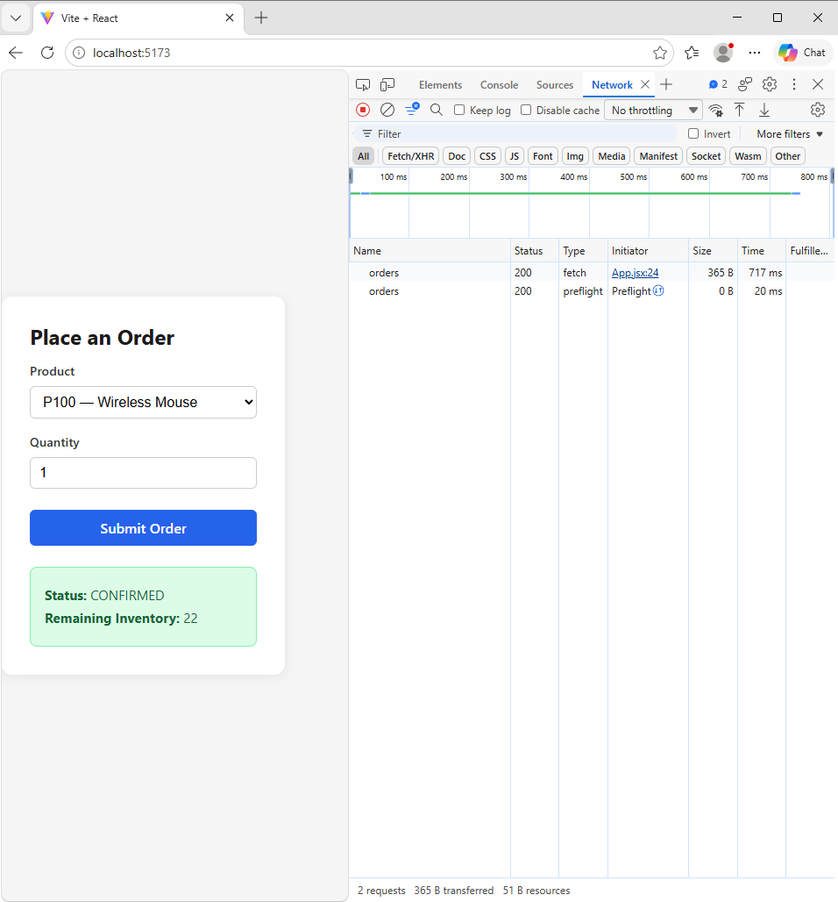
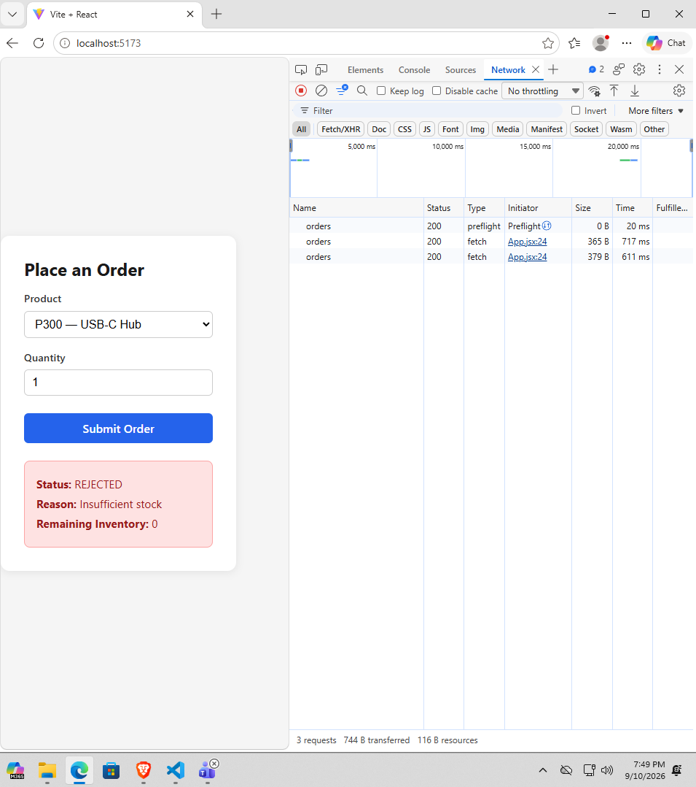

# Modular Monolith Integration with a React Frontend

A Spring Boot backend with two in-process modules (`shop` / Order and `inventory` / Inventory) backed by Supabase (Postgres), connected to a React (Vite) frontend over REST.

## Project Structure
shopinventory-lab/
├── backend/ # Spring Boot app (edu.cit.antolijao.shop, edu.cit.antolijao.inventory)
├── frontend/ # React (Vite) app
├── sql/ # SQL script used to create/seed Supabase tables
└── screenshots/ # Network tab evidence (confirmed + rejected orders)


## Supabase Setup Steps

1. Create a free project at [supabase.com](https://supabase.com).
2. Go to the **SQL Editor** in the Supabase dashboard and run the script in [`sql/schema.sql`](sql/schema.sql) to create and seed the `inventory` and `orders` tables.
3. Go to **Project Settings → Database → Connection Pooling** and copy the **Session Pooler** connection details (host, port, username in the form `postgres.<project-ref>`). The Session Pooler is used here instead of the direct connection because the direct connection failed with a DNS resolution error on the network used for development (likely an IPv6-only routing issue).
4. Set your database password as an environment variable named `SUPABASE_DB_PASSWORD` — **never commit this value to the repo**. In PowerShell, before running the backend:
```powershell
   $env:SUPABASE_DB_PASSWORD="your-db-password"
```
5. `backend/src/main/resources/application.properties` references this environment variable directly:
```properties
   spring.datasource.password=${SUPABASE_DB_PASSWORD}
```
   No credentials are hardcoded anywhere in the repository.

## Running the Backend

```powershell
cd backend
$env:SUPABASE_DB_PASSWORD="your-db-password"
.\mvnw.cmd spring-boot:run
```

Runs on `http://localhost:8083`.

## Running the Frontend

```powershell
cd frontend
npm install
npm run dev
```

Runs on `http://localhost:5173`.

## API

**POST** `/api/orders`

Request:
```json
{ "productId": "P100", "quantity": 2 }
```

Response:
```json
{ "status": "CONFIRMED", "reason": null, "inventory": 23 }
```

## Network Tab Evidence

**Confirmed order (P100, sufficient stock):**



**Rejected order (P300, 0 stock):**



## Reflection

**1. In-process vs. microservices integration.**

Running Order and Inventory as modules inside one Spring Boot process means calling `InventoryService.reserve()` is just a normal Java method call. It's synchronous, uses the same memory space, and shares a single database transaction — if the order write and the stock deduction need to succeed or fail together, one `@Transactional` boundary covers both. There's no network hop, no serialization, and no partial-failure state to reconcile: either the whole operation lands or none of it does.

If Inventory were split into its own microservice, all of that "for free" behavior disappears. The call becomes an HTTP or messaging request across the network, which means it can time out, the other service can be temporarily unreachable, or the response can arrive late or out of order. We'd need to add retry logic, timeouts, and circuit breakers; a way to keep data consistent across two databases (e.g. sagas or eventual consistency, since one distributed transaction across two services isn't practical); versioned API contracts between the two teams/services; and separate deployment, monitoring, and logging for each service. In short, the in-process version gets consistency and simplicity for free, and a microservices split trades that away for independent scalability and deployability.

**2. Why package-private `InventoryServiceImpl` matters.**

Making `InventoryServiceImpl` package-private (no `public` modifier) means classes outside the `inventory` package — including the `shop` package — physically cannot reference the class at compile time. The Order module is forced to depend only on the `InventoryService` interface, which is the intended, stable contract between the two modules.

If `InventoryServiceImpl` were public, nothing would stop `OrderService` from injecting or instantiating the implementation class directly, bypassing the interface. That would silently create a hidden coupling: any internal refactor to `InventoryServiceImpl` (renaming fields, changing internal helper methods, changing how it talks to the repository) could break the Order module even though the public interface never changed. Package-private visibility turns an architectural rule ("only talk to Inventory through its interface") into something the compiler enforces, rather than something that depends on developer discipline and code review to hold up over time.

**3. When to extract Inventory into its own microservice.**

Extraction would make sense once Inventory needs to scale, deploy, or evolve independently from Order — for example, if inventory checks are hit by a much higher volume of traffic than order placement, if a separate team owns Inventory and needs to release on its own schedule, or if Inventory needs its own database/technology choice for performance reasons.

To actually do it, `InventoryService`'s single Java interface would need to be replaced with a network client (REST or messaging) implementing the same method signatures, so `OrderService` still depends on an interface but the implementation now makes an HTTP call instead of a direct method call. Inventory would need its own database (no longer sharing the same Postgres instance/transaction with Order), its own deployable service with health checks and logging, and `OrderService`'s logic would need to handle network failure modes it never had to consider before — timeouts, retries, and how to keep the order and the inventory reservation consistent without a shared transaction (e.g. reserve-then-confirm, or a saga/compensating-action pattern if the reservation succeeds but the order write fails afterward).